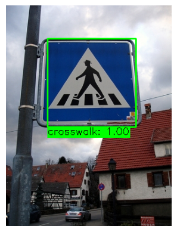
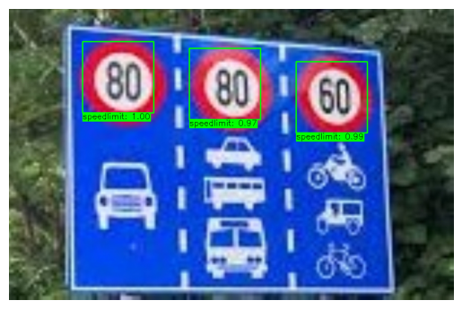

# [PROJECT] Road Sign Detector Project

## Introduction

This project aims to develop a program that uses machine learning algorithms to classify traffic signs. Here we have three datasets of crosswalk, speedlimit and stop sign with Support Vector Machines(SVM), Histograms of Oriented Gradient(Hog), Pyramid Image technique.

## Datasets

You can download my dataset in this repository in "Datasets" directory.

## Steps

<ul>
    <li> First we will train the model with SVM algorithm to predict the name of the traffic sign with following steps:
        <ul>
            <li> First we will read all the images, using Hog to increase the ability of the model to predict.
            <li> using Standard Scaler to Scaler the data.
            <li> Train the model with SVM algorithms. </li>
        </ul>
    <li> Then we will build functions object detection using sliding window, pyramid image and intersection over Union to draw the area of traffic sign.
</ul>

## Examples

 
 
 

## Requirements

- **Python.**
- **Support Vector Machine, Hog, Sliding window.**
- **Read xml file.**

## References

- Dataset from <a href="https://aivietnam.edu.vn/?fbclid=IwY2xjawIvzm9leHRuA2FlbQIxMAABHQ54_Y7iHtWi4op35SgjVNrie4J7GHRXj752yOay1hqPQAvNIDui67awgA_aem_deeml_7GV895jlOz1hc46g"> AI Viet Nam
